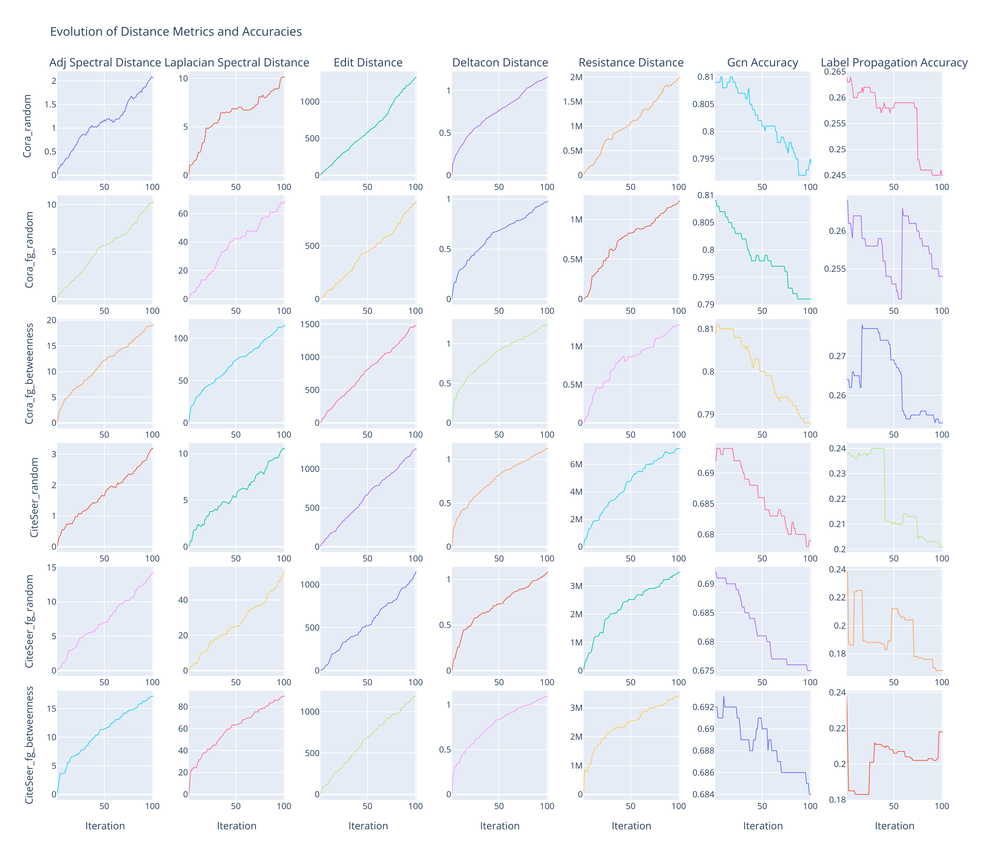

# Graph Distance Evolution Under Adversarial Perturbations in GNNs

This project focuses on performing targeted attacks on graph datasets by perturbing links using different methodologies. The main objective is to compare the original and perturbed graphs during the attack using several graph distance metrics and to analyze the evolution of these distance metrics over time (iterations, which represent the number of attacked nodes).

## Graph Attacks

### Random Attack

- Randomly select a set of nodes $\mathcal{V}_{\text{attack}} \subset \mathcal{V}$.
- For each node $v \in \mathcal{V}_{\text{attack}}$, randomly modify edges by adding or removing connections:

$$\text{Modify edges } \mathcal{E}_v \subseteq \set{(v, u) \mid u \in \mathcal{V},\ u \neq v}$$

### Fast Gradient Attack (Random Nodes)

- Randomly select a set of nodes $\mathcal{V}_{\text{attack}} \subset \mathcal{V}$.
- For each node $v \in \mathcal{V}_{\text{attack}}$:
  - Compute the gradient of the loss $\mathcal{L}$ with respect to the adjacency matrix $A$:
    
$$\nabla_A \mathcal{L}(v) = \frac{\partial \mathcal{L}(v)}{\partial A}$$

  - Identify the edges with the highest absolute gradient values.
  - Modify the adjacency matrix by adjusting these edges:
 
$$A' = A + \epsilon \cdot \text{sign}\left( \nabla_A \mathcal{L}(v) \right)$$

### Fast Gradient Attack (Betweenness Centrality)

- Compute betweenness centrality scores $C_B(v)$ for all nodes $v \in \mathcal{V}$.
- Select a set of nodes with the highest betweenness centrality:
  
$$\mathcal{V}_{\text{attack}} = \set{ v \in \mathcal{V} \mid C_B(v) \text{ is among top } k }$$

- For each node $v \in \mathcal{V}_{\text{attack}}$:
  - Compute the gradient of the loss $\mathcal{L}$ with respect to the adjacency matrix $A$:
    
$$\nabla_A \mathcal{L}(v) = \frac{\partial \mathcal{L}(v)}{\partial A}$$

  - Identify the edges with the highest absolute gradient values.
  - Modify the adjacency matrix by adjusting these edges:
    
$$A' = A + \epsilon \cdot \text{sign}\left( \nabla_A \mathcal{L}(v) \right)$$

## Empirical Results

Below are the visualizations generated from the analysis, located in the `figs` folder.

### Evolution of Distance Metrics and Accuracies

This figure illustrates the evolution of various distance metrics and accuracies over the iterations for each combination of dataset and attack type.

**Mathematical Formulations:**

- **Adjacency Spectral Distance**: The spectral distance between the original adjacency matrix $A$ and the perturbed adjacency matrix $A'$, based on their eigenvalues $\lambda_i$ and $\lambda'_i$:

$$d_{\text{adj}} = \sqrt{ \sum_{i=1}^n (\lambda_i - \lambda'_i)^2 }$$

- **Laplacian Spectral Distance**: The spectral distance between the original Laplacian matrix $L$ and the perturbed Laplacian matrix $L'$, using their eigenvalues $\mu_i$ and $\mu'_i$:

$$d_{\text{lap}} = \sqrt{ \sum_{i=1}^n (\mu_i - \mu'_i)^2 }$$

- **Edit Distance**: The total number of edge additions and deletions required to transform $A$ into $A'$:

$$d_{\text{edit}} = \sum_{i=1}^n \sum_{j=1}^n | A_{ij} - A'_{ij} |$$

- **DeltaCon Distance**: A measure of similarity between two graphs based on the belief propagation matrices $S$ and $S'$:

$$d_{\text{DeltaCon}} = \sqrt{ \sum_{i=1}^n \sum_{j=1}^n \left( \sqrt{ S_{ij} } - \sqrt{ S'_{ij} } \right)^2 }$$

- **Resistance Distance**: The sum of absolute differences between the effective resistance matrices $R$ and $R'$:

$$d_{\text{resistance}} = \sum_{i=1}^n \sum_{j=1}^n | R_{ij} - R'_{ij} |$$

- **GCN Accuracy**: The accuracy of the Graph Convolutional Network predictions:

$$\text{Accuracy}_{\text{GCN}} = \frac{ \text{Number of Correct Predictions} }{ \text{Total Number of Predictions} }$$

- **Label Propagation Accuracy**: The accuracy of the Label Propagation algorithm:

$$\text{Accuracy}_{\text{LP}} = \frac{ \text{Number of Correct Predictions} }{ \text{Total Number of Predictions} }$$

<p align="center">
  
</p>

### Correlation Heatmaps

These heatmaps display the Pearson and Spearman correlations between the distance metrics and accuracies for each dataset and attack type.

**Mathematical Formulations:**

- **Pearson Correlation Coefficient** between variables $X$ and $Y$:

$$r_{XY} = \frac{ \sum_{i=1}^n (X_i - \bar{X})(Y_i - \bar{Y}) }{ \sqrt{ \sum_{i=1}^n (X_i - \bar{X})^2 } \sqrt{ \sum_{i=1}^n (Y_i - \bar{Y})^2 } }$$

- **Spearman Rank Correlation Coefficient**:

$$\rho_{XY} = 1 - \frac{6 \sum_{i=1}^n d_i^2 }{ n(n^2 - 1) }$$

  where $d_i = \text{rank}(X_i) - \text{rank}(Y_i)$.

<p align="center">
  
  
</p>

### PCA Cumulative Explained Variance

This figure shows the cumulative explained variance obtained from applying PCA to the distance metrics for each dataset and attack type. A horizontal line at a threshold of 0.999 is included.

**Mathematical Formulations:**

- **Principal Component Analysis (PCA)** transforms the data into a set of linearly uncorrelated variables (principal components):

$$Z = X W$$

  where $X$ is the standardized data matrix, and $W$ is the matrix of eigenvectors.

- **Explained Variance Ratio** for the $k$-th principal component:

```math
\text{Explained Variance Ratio}_k = \frac{\lambda_k }{ \sum_{i=1}^p \lambda_i}
```

  where $\lambda_k$ is the eigenvalue corresponding to the $k$-th principal component.

- **Cumulative Explained Variance** up to the $k$-th component:

```math
\text{Cumulative Explained Variance}_k = \sum_{i=1}^k \text{Explained Variance Ratio}_i
```

<p align="center">
  
</p>

### R-squared Values of Factor Models

This heatmap presents the R-squared values of the factor models obtained by regressing the top principal components (factors) to explain the GCN accuracy over time for each dataset and attack type.

**Mathematical Formulations:**

- **Linear Regression Model**:

  $$y = \beta_0 + \beta_1 Z_1 + \beta_2 Z_2 + \beta_3 Z_3 + \varepsilon$$

  where $y$ is the GCN accuracy, $Z_i$ are the top principal components, $\beta_i$ are coefficients, and $\varepsilon$ is the error term.

- **Coefficient of Determination ($R^2$)**:

```math
R^2 = 1 - \frac{ \sum_{i=1}^n ( y_i - \hat{y}_i )^2 }{ \sum_{i=1}^n ( y_i - \bar{y} )^2 }
```

  where $\hat{y}_i$ is the predicted value, and $\bar{y}$ is the mean of $y$.

<p align="center">
  
</p>

## Code

The following code was used to perform the attacks and generate the results:

```python
import os

from graph_attacks import perform_attack

datasets = ['Cora', 'CiteSeer']
attack_types = ['random', 'fg_random', 'fg_betweenness']
n_iterations = 100

# Define the output directory
output_dir = "attack_results"
os.makedirs(output_dir, exist_ok=True)  # Create the directory if it doesn't exist

# Loop over each dataset
for dataset_name in datasets:
    # Loop over each attack type
    for attack_type in attack_types:
        print(f"\nPerforming '{attack_type}' attack on '{dataset_name}' for {n_iterations} iterations...")
        try:
            # Perform the attack and get the results DataFrame
            df = perform_attack(dataset_name, n_iterations, attack_type)

            # Construct the filename with configuration details
            filename = f"{dataset_name}_{attack_type}.csv"

            # Define the full path to save the CSV
            filepath = os.path.join(output_dir, filename)

            # Save the DataFrame to CSV
            df.to_csv(filepath, index=False)

            print(f"Results saved to '{filepath}'.")
        except Exception as e:
            print(f"An error occurred while performing the attack: {e}")
```
