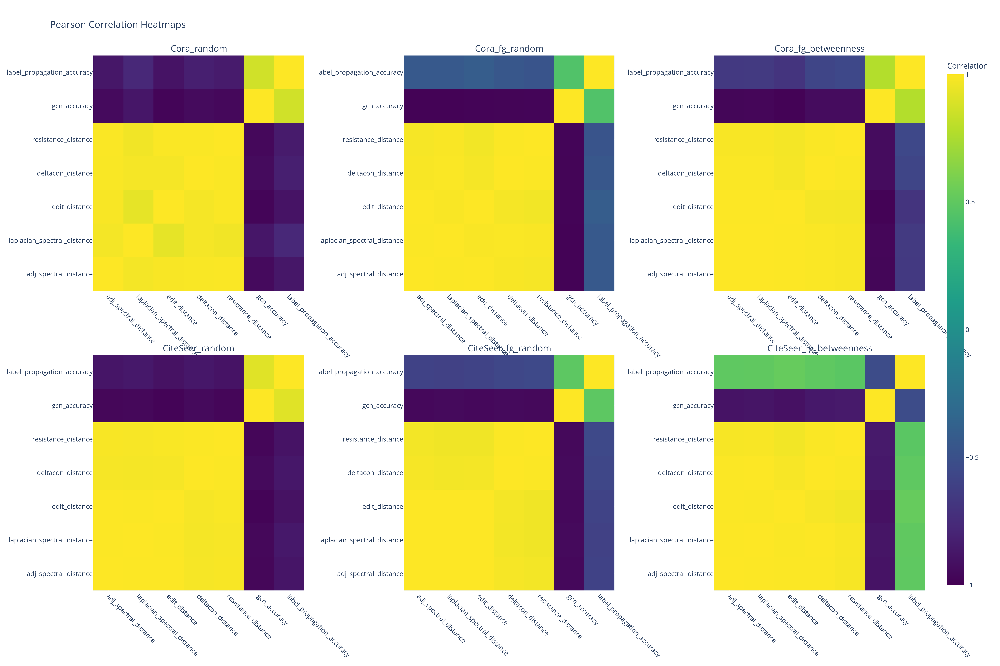
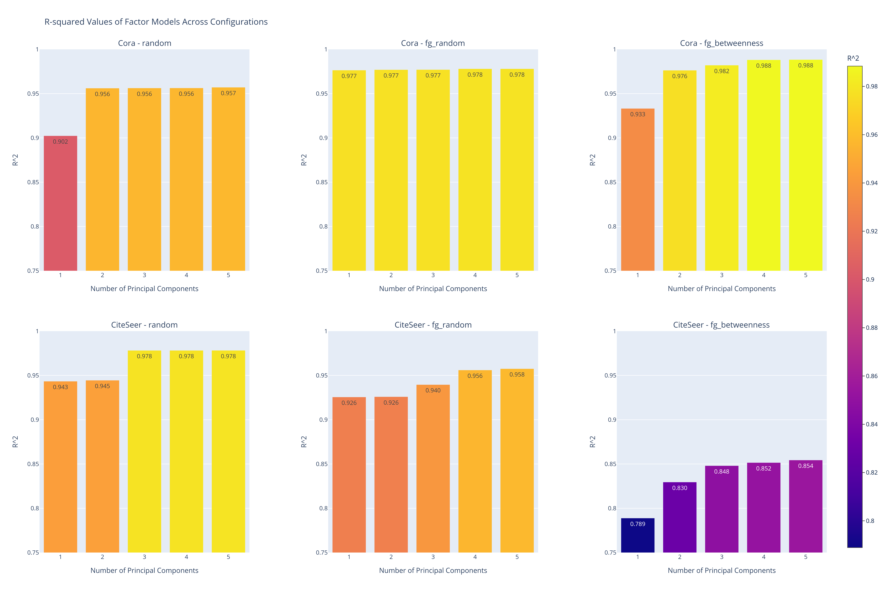

# Graph Distance Evolution Under Adversarial Perturbations in GNNs
This project focuses on performing targeted attacks on graph datasets by perturbing links using different methodologies. The main objective is to compare the original and perturbed graphs during the attack using several graph distance metrics and to analyze the evolution of these distance metrics over time (iterations, which represent the number of attacked nodes).

## Empirical Results

Below are the visualizations generated from the analysis, located in the `figs` folder.

### Evolution of Distance Metrics and Accuracies

This figure illustrates the evolution of various distance metrics and accuracies over the iterations for each combination of dataset and attack type.

<p align="center">
  
</p>

### Correlation Heatmaps

These heatmaps display the Pearson and Spearman correlations between the distance metrics and accuracies for each dataset and attack type.

<p align="center">
  
  
</p>

### PCA Cumulative Explained Variance

This figure shows the cumulative explained variance obtained from applying PCA to the distance metrics for each dataset and attack type. A horizontal line at a threshold of 0.9 is included.

<p align="center">
  
</p>

### R-squared Values of Factor Models

This heatmap presents the R-squared values of the factor models obtained by regressing the top principal components (factors) to explain the GCN accuracy over time for each dataset and attack type.

<p align="center">
  
</p>

## Code

The following code was used to perform the attacks and generate the results:

```python
datasets = ['Cora', 'CiteSeer', 'PubMed']
attack_types = ['random', 'fg_random', 'fg_betweenness']
n_iterations = 60

# Define the output directory
output_dir = "attack_results"
os.makedirs(output_dir, exist_ok=True)  # Create the directory if it doesn't exist

# Loop over each dataset
for dataset_name in datasets:
    # Loop over each attack type
    for attack_type in attack_types:
        print(f"\nPerforming '{attack_type}' attack on '{dataset_name}' for {n_iterations} iterations...")
        try:
            # Perform the attack and get the results DataFrame
            df = perform_attack(dataset_name, n_iterations, attack_type)

            # Construct the filename with configuration details
            filename = f"{dataset_name}_{attack_type}.csv"

            # Define the full path to save the CSV
            filepath = os.path.join(output_dir, filename)

            # Save the DataFrame to CSV
            df.to_csv(filepath, index=False)

            print(f"Results saved to '{filepath}'.")
        except Exception as e:
            print(f"An error occurred while performing the attack: {e}")
```
